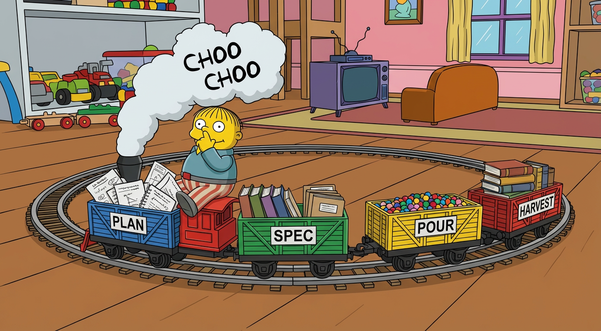

# Choo Choo Ralph

<p align="center">
  
</p>


<p align="center">
  <a href="#quick-start">Quick Start</a> •
  <a href="#the-workflow">The Workflow</a> •
  <a href="#compounding-knowledge">Compounding Knowledge</a> •
  <a href="#documentation">Documentation</a>
</p>

<p align="center"><em>Relentless like a train. Persistent like Ralph Wiggum. Ships code while you sleep.</em></p>

> **🧪 Experimental** — This workflow is being actively developed and tested on real projects. The approach works well for me: smaller, verified tasks trade higher Claude Code usage for more reliable outcomes. Your mileage may vary. I'd love feedback on what works and what doesn't.

---

## The Idea

Most autonomous coding setups fall into two traps:

1. **Too simple** - Run Claude in a loop, hope for the best, watch it spiral when something breaks
2. **Too complex** - Build elaborate orchestration that's harder to debug than the code it writes

Choo Choo Ralph is neither. The outer loop is dead simple. The workflow inside each task is structured and verified. Each task remembers its own history across sessions.

**The thesis**: Simple loop + smart workflow + persistent memory = autonomous coding that actually works.

### What We Don't Do

Planning. Your planning process is yours - downloading repos, grepping through code, iterating with different AI agents, writing markdown docs that evolve through discussion. That's creative, messy work that can't be captured in a command.

### What We Do

Take your plan - however rough or polished - and turn it into something an autonomous agent can execute reliably:

1. **Spec** - Structure your plan into reviewable tasks with test steps
2. **Pour** - Break those into granular, atomic units of work
3. **Run** - Execute them one by one with verification
4. **Learn** - Capture what the agents discover along the way

## What You Get

- **Verified, not vibes** - Health checks before implementing, tests and browser verification after
- **Bounded context** - Each task tracks its own history via [Beads](https://github.com/steveyegge/beads), no context window bloat
- **Structured phases** - Bearings → Implement → Verify → Commit (not just "do the thing")
- **Compounding knowledge** - Agents capture learnings as they work; [harvest](#compounding-knowledge) them into skills and docs that make future sessions smarter
- **Pick up where you left off** - Tasks persist across sessions, crashes, and context resets

## The Workflow

```
┌─────────────┐     ┌─────────────┐     ┌─────────────┐     ┌─────────────┐     ┌─────────────┐
│   1. Plan   │ ──▶ │  2. Spec    │ ──▶ │  3. Pour    │ ──▶ │  4. Ralph   │ ──▶ │ 5. Harvest  │
│    (you)    │     │  (you + AI) │     │    (AI)     │     │    (AI)     │     │ (you + AI)  │
└─────────────┘     └─────────────┘     └─────────────┘     └─────────────┘     └─────────────┘
```

1. **Plan** - Write what you want to build *(this is on you - we don't do planning)*
2. **Spec** - AI transforms it into structured tasks; you review and refine
3. **Pour** - Tasks become beads (workflow or singular)
4. **Ralph** - The loop runs autonomously until done
5. **Harvest** - Extract learnings into skills, docs, or CLAUDE.md

For the complete step-by-step guide, see [docs/workflow.md](docs/workflow.md).

## Prerequisites

- [Claude Code](https://claude.com/claude-code) - Anthropic's CLI
- [Beads](https://github.com/steveyegge/beads) - Git-backed issue tracker (`bd` command)
- [jq](https://jqlang.github.io/jq/) - JSON parsing

**Recommended:**
- [dev-browser](https://github.com/SawyerHood/dev-browser) - Browser automation for UI verification

---

## Quick Start

<details>
<summary>⚠️ <strong>Safety Warning</strong> - Read before running</summary>

Ralph runs Claude with `--dangerously-skip-permissions`, which allows it to execute commands without confirmation. This is powerful but risky.

**We strongly recommend:**
- Run in a **Docker container** or **VM**
- Use a machine that doesn't have your life's work on it
- Start with small, low-risk tasks until you trust the setup
- Review the formulas and scripts before running

By using this project, you accept full responsibility for any consequences.

</details>

```bash
# Install plugin
/plugin marketplace add mj-meyer/choo-choo-ralph
/plugin install choo-choo-ralph@choo-choo-ralph

# Set up project
/choo-choo-ralph:install

# Generate spec from your plan
/choo-choo-ralph:spec plans/my-feature.md

# Review the spec, then pour into beads
/choo-choo-ralph:pour

# Start the loop
./ralph.sh
```

For the complete workflow guide, see [docs/workflow.md](docs/workflow.md).

---

## Why "Choo Choo Ralph"?

**Choo Choo** - Like a train with carts. Each cart is a containerized block of work - self-contained, carrying its own context and history. The train keeps moving forward, cart after cart, toward your destination.

**Ralph** - Named after the [Ralph Wiggum technique](https://ghuntley.com/ralph/): run an AI in a loop until it's done. Simple, relentless, surprisingly effective. Ralph makes mistakes, gets confused, but never stops trying.

---

## Why Beads?

Choo Choo Ralph requires [Beads](https://github.com/steveyegge/beads) for task management. Here's why:

**Molecules (Workflows)** - Formulas define multi-step workflows that automatically create parent tasks with child steps. Sub-agents verify independent steps that still relate to the main task.

**Clean CLI** - All the organizational work is abstracted behind `bd` commands. No cluttering your codebase with planning files.

**Local-First** - Beads runs locally with no network layer. Unlike GitHub Issues, agents don't hit rate limits or network errors when updating tasks.

**Git-Native** - Everything syncs to git as JSONL. You can convert to Markdown later if needed, and all history is preserved.

**Bounded Context** - Each bead carries its own history. Context stays contained instead of growing unbounded.

> [!IMPORTANT]
> Beads is a **hard requirement** for Choo Choo Ralph. The plugin's pour and formula system depends on Beads' molecule feature to create multi-step workflows.

---

## Compounding Knowledge

Every task teaches your agents something. The question is: do you capture it?

```
Iteration 1: Write code → Discover patterns → Capture as comments
Iteration 2: Write code → Learn from previous → Capture new insights
Iteration 3: Harvest learnings → Create skills/docs → Future agents are smarter
Iteration 4: New agent benefits from skills → Works faster → Discovers more
...repeat...
```

**The flywheel:**
1. **Code** - Each task produces working, tested, committed code
2. **Memory** - Agents capture gaps and learnings as comments on beads
3. **Harvest** - You extract valuable patterns into skills, CLAUDE.md, docs
4. **Compound** - Future iterations benefit from accumulated knowledge
5. **Repeat** - The system gets smarter with every session

Run `/choo-choo-ralph:harvest` after a session to gather learnings and propose documentation artifacts.

---

## Customization

When you run `/choo-choo-ralph:install`, you get local copies of everything—shell scripts, formulas, and config. These files are yours to modify. One project might need tweaked prompts; another works fine with defaults.

**What you can customize:**

- **Shell scripts** (`ralph.sh`, `ralph-once.sh`) - Loop behavior, task limits, output formatting
- **Formulas** (`.beads/formulas/`) - Workflow steps, prompts, verification requirements
- **Specs** (`.choo-choo-ralph/`) - Your planning and review process

For the complete guide, see [docs/customization.md](docs/customization.md).

---

## Documentation

- [Complete Workflow Guide](docs/workflow.md) - Step-by-step from planning to harvest
- [Spec Format Reference](docs/spec-format.md) - XML structure and review process
- [Commands Reference](docs/commands.md) - All options and arguments
- [Customization Guide](docs/customization.md) - Adapting Ralph to your project
- [Formula Reference](docs/formulas.md) - Creating and modifying workflow formulas
- [Troubleshooting](docs/troubleshooting.md) - Error handling and debugging

---

## Further Reading

**Ralph Technique**
- [ghuntley.com/ralph](https://ghuntley.com/ralph/) - The original Ralph philosophy
- [Matt Pocock's Ralph Guide](https://www.aihero.dev/tips-for-ai-coding-with-ralph-wiggum) - Practical tips

**Anthropic Research**
- [Effective Harnesses for Long-Running Agents](https://www.anthropic.com/engineering/effective-harnesses-for-long-running-agents) - Two-agent pattern, verification

**Tools**
- [Beads](https://github.com/steveyegge/beads) - Git-backed issue tracker with molecules
- [dev-browser](https://github.com/SawyerHood/dev-browser) - Browser automation for Claude Code
- [Claude Code](https://claude.com/claude-code) - Anthropic's CLI for agentic coding

## License

MIT
